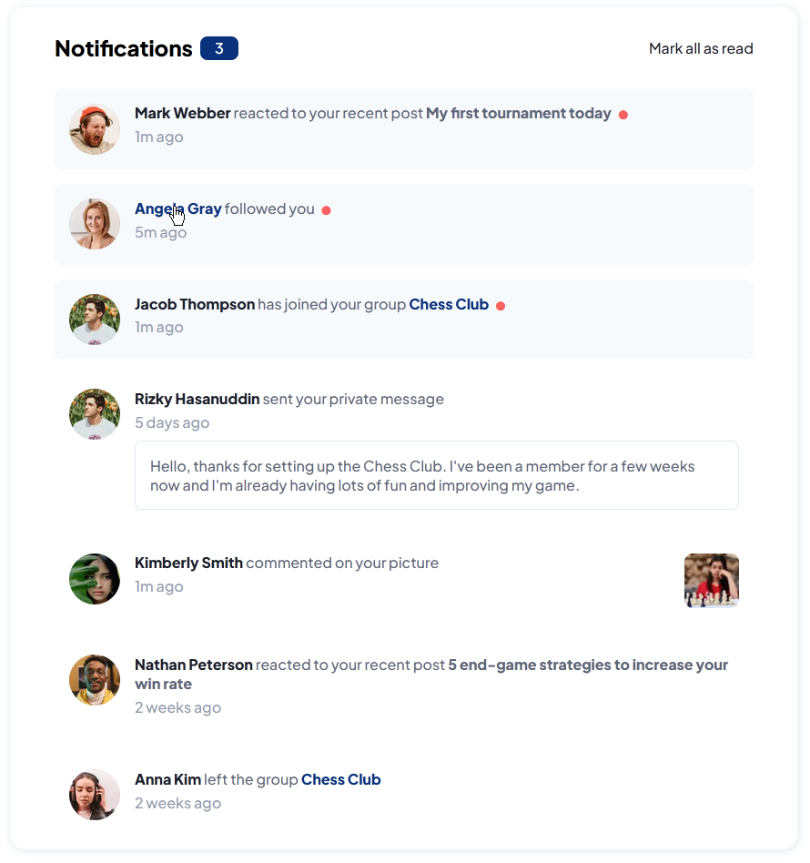
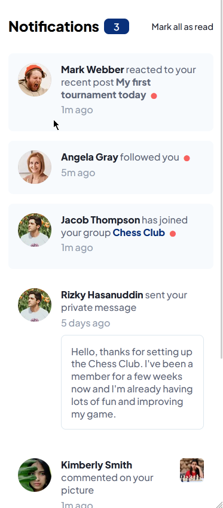

# Frontend Mentor - Notifications page solution

This is a solution to the [Notifications page challenge on Frontend Mentor](https://www.frontendmentor.io/challenges/notifications-page-DqK5QAmKbC). Frontend Mentor challenges help you improve your coding skills by building realistic projects.

### The challenge

Users should be able to:

- Distinguish between "unread" and "read" notifications
- Select "Mark all as read" to toggle the visual state of the unread notifications and set the number of unread messages to zero
- View the optimal layout for the interface depending on their device's screen size
- See hover and focus states for all interactive elements on the page

### Screenshot

### Links

- Source Code URL: [Source Github](https://github.com/lenez12/intro-section-with-dropdown-navigation-main.git)
- Live Site URL: [Demo Live](https://lenez-intro-section.netlify.app/)

## My process

### Built with

- Semantic HTML5 markup
- CSS custom properties
- Flexbox
- CSS Grid
- JQuery
- JQuery Masking Input
- vanilla js

### What I learned

what I learned in making this challenge is:

1. layouting using grid css and flex
2. create dropdown menu on hover
3. create accordion menu with javascript
4. responsive layout mobile [375] and desktop [1440]
5. dimensions of element is affect againt of the wrapper

### Continued development

1. In the future I will make a good css class naming name
2. add animation and transition when hover and activate
3. using react to create this layout.

### Useful resources

- [Centering CSS GRID](https://stackoverflow.com/questions/45536537/centering-in-css-grid)
- [Reset CSS](https://piccalil.li/blog/a-modern-css-reset/)
- [Event in DOM](https://developer.mozilla.org/en-US/docs/Web/API/HTMLElement/change_event)
- [Fix Z-index](https://www.freecodecamp.org/news/4-reasons-your-z-index-isnt-working-and-how-to-fix-it-coder-coder-6bc05f103e6c/)
- [Translate](https://developer.mozilla.org/en-US/docs/Web/CSS/transform-function/translate)
- [background position](https://css-tricks.com/almanac/properties/b/background-position/)

## Author

- Frontend Mentor - [@Lenez](https://www.frontendmentor.io/profile/lenez12)
- Twitter - [@prak_tech](https://www.twitter.com/prak_tech)

